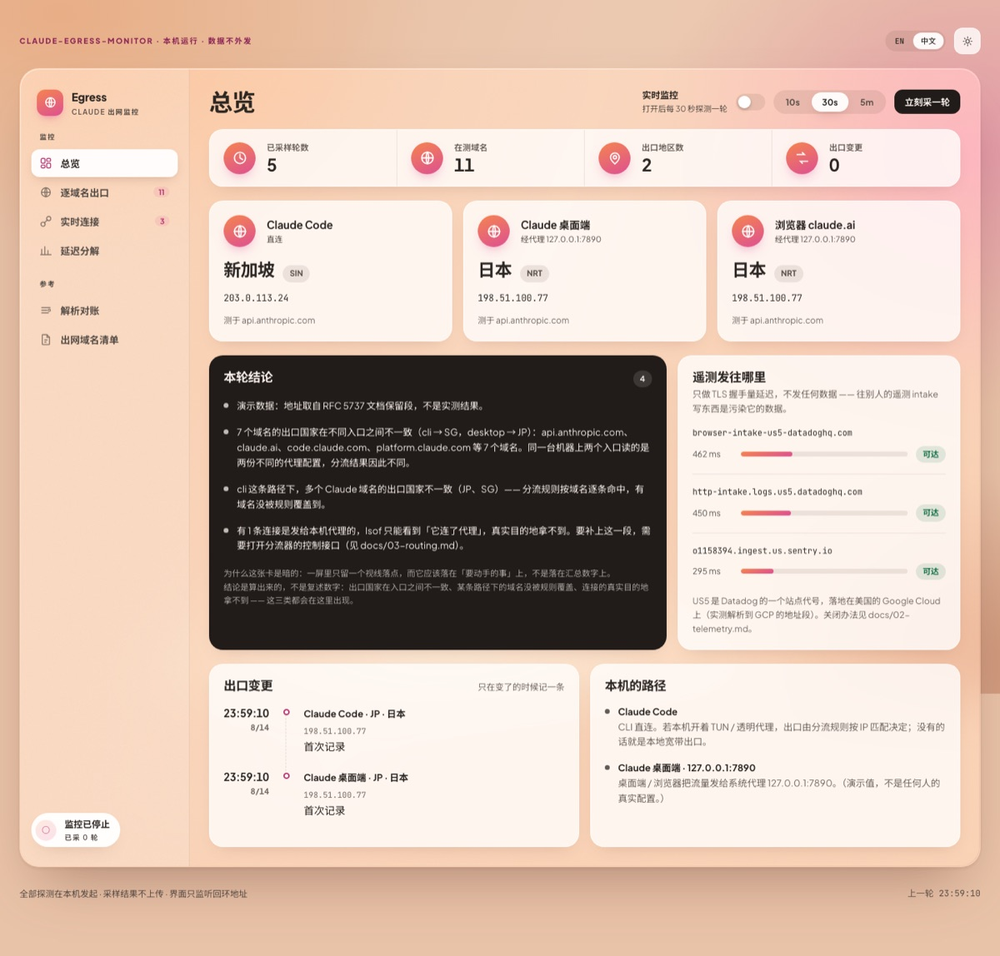
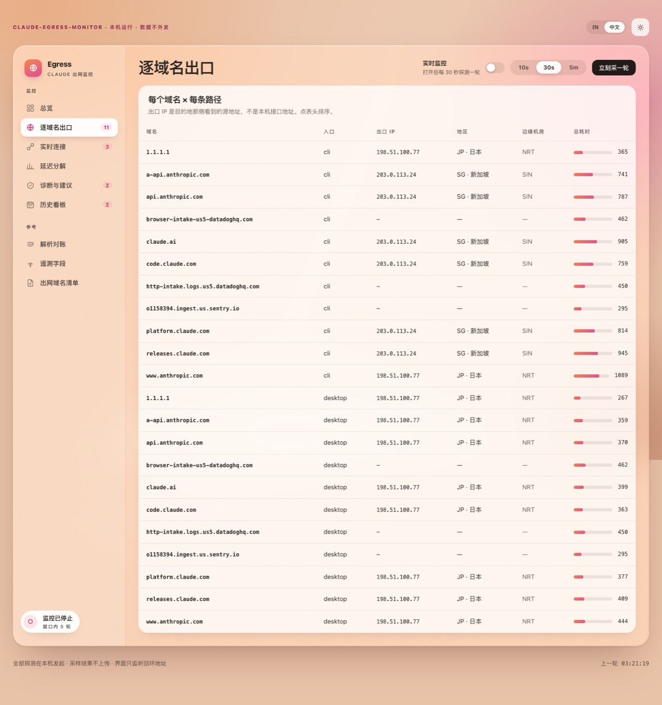
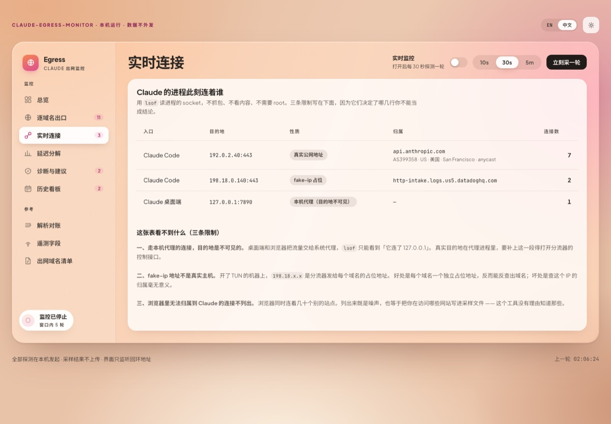
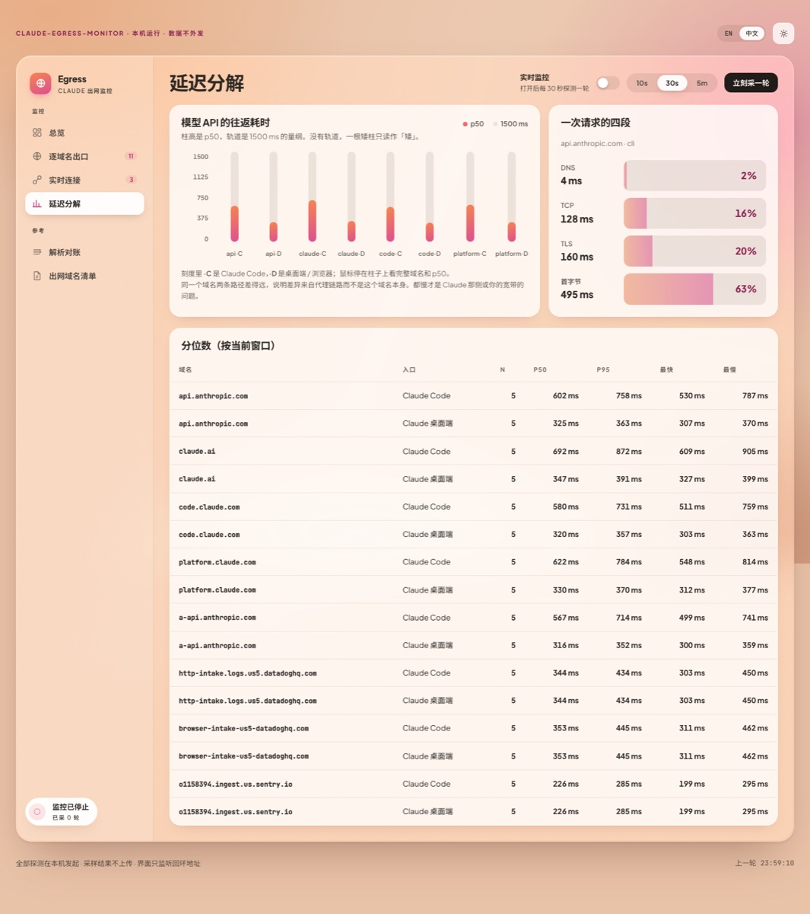
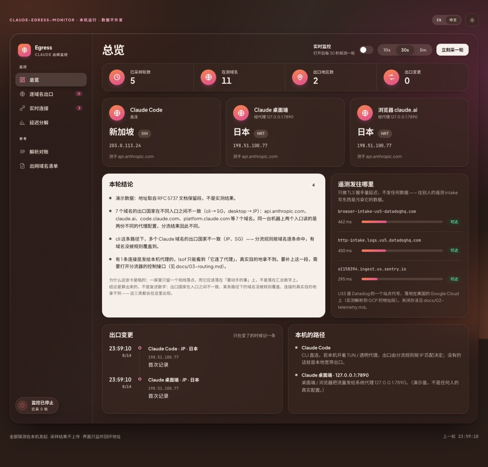

# claude-egress-monitor

**看清 Claude 的流量从哪出去。** Claude Code、Claude 桌面端、浏览器里的
claude.ai —— 同一台机器上，这三个入口的出口 IP 和落地地区**可以不一样**，
而它们都不会告诉你这件事。

这个工具把它量出来：每个入口的出口 IP、落地国家、Cloudflare 边缘机房、
分段延迟、遥测发往哪个地区，以及 Claude 的进程此刻实际连着谁。

零第三方依赖（只用 Python 标准库）。全部探测在本机发起，
**采样结果不上传到任何地方**，监控默认关闭。

还会告诉你出口是**机房还是家宽**、地址是**动态还是静态**、
两个入口的出口不一致时**具体该改哪一行配置**，以及长期开着监控之后
**按天归档的历史看板**（可选、可删）。

**📖 文档站：<https://doc.tbusos.com/claude-egress-monitor/>** ·
**🖥 可点的成品界面：<https://doc.tbusos.com/claude-egress-monitor/demo.html>** ·
**🧩 架构与设计：<https://doc.tbusos.com/claude-egress-monitor/architecture.html>**



*（截图是 `--demo` 模式，地址取自 RFC 5737 文档保留段，不是任何人的真实数据。）*

---

## 为什么需要它

Node 默认**不读系统代理**。所以：

| 入口 | 读什么代理配置 |
|---|---|
| Claude Code（CLI） | 只认 `HTTPS_PROXY` / `HTTP_PROXY` 环境变量，没设就直连 |
| Claude 桌面端（Electron） | 认**操作系统**的代理设置 |
| 浏览器里的 claude.ai | 认系统代理，除非代理插件自己接管 |

你在系统设置里配好代理，桌面端立刻生效，而 Claude Code 完全不知道它存在。
再叠上分流器"按 IP 匹配"和"按域名匹配"是两套不同的过程 ——
**同一个域名从 CLI 出去和从桌面端出去，落地国家可以不同。**

这件事有三个具体后果：

1. **账号风险。** 出口落在 Claude 的受限地区（中国大陆、香港、俄罗斯…）
   会触发风控，而你可能只在其中一个入口上落在那里。
2. **合规。** 遥测发到美国的 Datadog，某些组织需要显式说明；
   业务流量和遥测还可能走**不同的出口**。
3. **排查方向错。** "Claude 很慢"有四种原因，修法完全不同。
   没有分段数据就只能瞎换节点。

更详细的原理见 [docs/03-routing.md](docs/03-routing.md)。

---

## 快速开始

要求 **Python 3.9+**，macOS。不需要安装任何包，不需要 root。

```bash
git clone https://github.com/TbusOS/claude-egress-monitor.git
cd claude-egress-monitor

# 1. 先看清本机三个入口各走哪条路（不发任何探测）
python3 -m cem doctor

# 2. 立刻采一轮，打印在终端
python3 -m cem probe

# 3. 起界面。监控默认是关的，在页面上按开关启动
python3 -m cem serve --open
```

只想看看界面长什么样、不联网：

```bash
python3 -m cem serve --demo --open      # 注入虚构数据，一个探测都不发
```

---

## 界面上有什么

**总览** — 三个入口各一张卡（出口 IP / 地区 / 边缘机房），
一张暗卡放算出来的**结论**（哪些域名的出口不一致、哪条路径没被规则覆盖、
哪些连接的目的地看不到），遥测目的地的可达性与延迟，出口变更时间轴。

**逐域名出口** — 每个域名 × 每条路径的出口 IP、地区、colo、耗时，可排序。



**实时连接** — Claude 的进程此刻连着谁，附带 ASN / 归属 / 地区，
以及**这张表看不到什么**的三条限制。



**延迟分解** — DNS / TCP / TLS / 首字节四段，p50 / p95 分位数。
一个总数说明不了任何事，[原因在这里](docs/04-latency.md)。



**路径质量**（需要装 `mtr`）— 逐跳延迟与丢包，回答四段延迟答不了的那个问题：
TLS 忽快忽慢是距离远还是链路在丢包。

一个按钮把**所有** Claude 域名加对照组测一遍，或者打开**自动探测**让它
按 1 / 5 / 15 分钟自己跑（默认关闭 —— 这是本工具唯一会主动发 ICMP 的地方）。
一遍要一到两分钟，所以它有自己的开关和间隔，不跟着主监控走；跑的时候按钮上
有 `N/M` 进度，结果一条一条冒出来。**解析到同一个地址的域名只测一次**，
重复测七遍同一条路径不会多出任何信息。

这一屏最重要的是**丢包的读法**，三条：

- 中间跳的丢包大多是路由器给 ICMP 限速造成的假象，所以显示成灰的，
  只有终点的丢包能当真；
- 终点一个包都不回时写「**量不出来**」，不写「丢包 100%」——
  后者会让人去换节点，换完还是 100%；
- 目标解析到 fake-ip 占位地址时**直接拒测并说明原因**。硬测会得到一个
  一跳、零点几毫秒的漂亮结果，那是本机分流器自己应答的 ——
  这种假数字比没有数字危险得多。

**诊断与建议** — 每条都带**判据**（算出它的实测数字）、**成因**（不是现象的复述）、
**下一步**（可以直接照做的命令或配置）。旁边是环境检查：IPv6 可达性、系统时钟偏移、
TLS 证书有没有被中间人拆开、两个权威 DNS 源是否一致、代理端口有没有进程在听。

**历史看板** — 按天归档（每轮约 1 KB，一天几 MB）。点日期卡选一天或多天看汇总：
出口国家构成、出口网络构成、按小时的延迟分布、出现过的所有出口地址及占比。
选中的天可以删 —— 长期开着监控历史会一直涨，删除必须是一等功能。

**遥测字段** — 从本机的 Claude Code 二进制里静态提取遥测会上报哪些字段。
不解密、不注入、不修改任何东西，只读一个已经在你硬盘上的文件。

**解析对账** — 本机 `getaddrinfo` 的结果 vs DoH 拿到的公网权威结果。
不一致就是本机 DNS 被改写了（fake-ip、split-DNS、hosts）——
"我以为流量走 A、其实走 B"几乎都从这里开始。

**出网域名清单** — Claude 会连哪些域名、各自干什么、证据来自哪里。
一个按钮**导出全集**（Markdown / 纯域名列表 / JSON），可以直接发给别人 ——
里面只有域名和用途，没有出口 IP、代理端口、进程名、ASN 归属和延迟数字。


暗色主题：



---

## 命令行

```
cem doctor                  看清本机三个入口各走哪条路
cem probe [--json]          立刻采一轮并打印
cem endpoints [--json]      打印出网域名清单
cem telemetry [--json]      遥测会上报哪些字段（静态提取，不解密）
cem export [选项]           导出 Claude 会访问的域名全集（可直接发给别人）
cem serve [选项]            启动网页界面
```

`serve` 的选项：

| 选项 | 说明 |
|---|---|
| `--port N` | 端口，默认 8787 |
| `--host H` | 监听地址，默认 `127.0.0.1`。**不建议改** |
| `--interval N` | 采样间隔秒数，默认 30（下限 5） |
| `--start` | 启动后立刻开始监控（默认关闭，等界面上手动开） |
| `--open` | 顺手打开浏览器 |
| `--demo` | 注入虚构数据看界面，一个探测都不发 |
| `--archive 路径` | 长期历史目录，按天分文件，默认 `./data/days` |
| `--no-archive` | 完全不落盘长期历史 |
| `--persist 路径` | 把每轮**完整**采样追加到 JSONL（**含真实 IP，注意别提交**） |
| `--cache-dir 路径` | ASN 查询结果缓存目录 |
| `--no-sockets` | 不调用 `lsof`，跳过实时连接 |
| `--no-dns` | 跳过解析对账 |
| `--no-telemetry` | 不探测遥测 intake 域名 |
| `--path-quality` | 每轮顺带跑一次 `mtr`（慢，需要装 mtr；界面上那个面板是按需触发的，不受这个开关影响） |
| `--all` | 连可选域名（MCP 之类）一起探测 |

---

## 导出域名全集

内置清单是人手维护的，**Claude 一更新就会过期**。所以工具还会自己发现，
把三个来源合成一张去重的表：

```bash
python3 -m cem export -o claude-域名清单.md          # 给人看的
python3 -m cem export --format text -o domains.txt   # 一行一个，喂分流规则
python3 -m cem export --format json -o domains.json  # 给工具读的
```

| 来源 | 拿到什么 | 需要什么 |
|---|---|---|
| 内置清单 | 人工整理过、每条写了用途 | — |
| **扫本机安装** | 二进制里写死的域名 | 什么都不用，**装上新版本当场发现** |
| 实时观测 | 真的连过的域名 | 开着监控 |

实测内置清单 14 个，扫一遍能多发现 20 多个 —— `preview.claude.ai`、
`gcal.mcp.claude.com`、`api-staging.anthropic.com` 之类。

**但「代码里写着」不等于「每次都会连」**：扫出来的里面混着真正的运行时目标、
界面上的链接（点了才打开）、以及只在特定功能开启后才用的。这三种从二进制里
分不出来，所以导出文件不猜 —— 证据摊开写，分「确证」（真抓到过连接）和
「代码里写着」两档。

导出文件的字段是**白名单**：只有域名、类别、用途、入口、证据、是否观测到。
没有出口 IP、代理端口、进程名、ASN 归属，也**没有延迟数字**（p50 能反推
你的大致位置，是弱指纹）。父域不认识的域名（可能是你自己配的 MCP 服务器）
默认扣下不导出，只报个数。

`tests/test_export.py` 里有一组用例专门断言导出的三种格式里不出现任何
IPv4 字面量、进程名、ASN 组织名 —— 谁将来加了带本机信息的字段会当场红。

---

## 它是怎么知道出口 IP 的

不靠猜，靠**问目的地**。

挂在 Cloudflare 上的站点都提供一个标准端点 `/cdn-cgi/trace`，
返回纯文本，其中 `ip=` 就是**Cloudflare 那一侧看到的你的源地址**：

```bash
curl -s https://claude.ai/cdn-cgi/trace
```

工具为每个入口造一条**等价探测路径**（用和该入口完全相同的代理配置），
分别去问这个端点。于是"目的地眼里的你"就是该入口真实的出口 —— 不是推的。

不在 Cloudflare 上的域名（遥测 intake、`downloads.claude.ai`）没有这个端点，
只能量可达性和延迟，界面上打「只能量延迟」标签。
对这类域名工具**只做 TLS 握手，不发任何 HTTP 请求** ——
往别人的遥测接入点写数据是污染他们的数据。

---

## 出口 IP 会变，这正常吗

工具把这个问题拆成三层，因为**「国家相同」不等于「出口相同」**：

| 一致性级别 | 含义 | 要不要管 |
|---|---|---|
| 单一出口 | 所有 Claude 域名同一个地址 | 最理想 |
| 同节点双栈 | 多个地址但同 ASN，v4/v6 各一 | 不用管，风控看到的是同一个网络 |
| 同一网络多地址 | 多个地址，同一家运营商 | 想固定就锁单节点，别用自动选优组 |
| 跨网络 | 不同 ASN，恰好同国家 | 该修：有域名没被分流规则覆盖 |
| 跨国家 | 落在不同国家 | 该修，且最要紧 |

还会判断**机房还是非机房宽带**，并且**每条判断都标出置信度**：

| 置信度 | 依据 |
|---|---|
| 确证 | 命中 AWS / GCP / Cloudflare **自己发布**的官方地址段 |
| 较可能 | 第三方数据源（ip-api）的 `hosting` / `mobile` 标志 |
| 推测 | 只有组织名或 rDNS 形态这一条弱线索 |
| 判不出 | 没有线索 —— **不猜**，因为把机房猜成家宽会让人以为风险更低 |

注意「住宅 vs 企业」**免费数据源分不开**（它只给"是不是机房"一个布尔值），
所以这一档叫「非机房宽带」而不是「住宅」——不宣称数据给不了的结论。

**动态还是静态地址**单次观测也答不了，必须连续观测 6 小时以上，
所以结论一定带着观测窗口。

## 需要装别的工具吗

不用。上面全部功能只依赖 Python 标准库和 macOS 自带的
`dig` / `lsof` / `scutil` / `ps`。

装一个 `mtr` 会多出**路径质量**这一个维度（跳数、每跳延迟、端到端丢包），
它能回答四段延迟答不了的那个问题：TLS 忽快忽慢是距离远还是在丢包。

```bash
bash scripts/install-deps.sh --dry-run   # 先看缺什么
bash scripts/install-deps.sh             # 装
```

**不需要逆向工具。** IDA / Ghidra / Frida 解决的是「这个二进制在算什么」，
而这里问的是「流量去哪」—— 答案在链路和系统状态里，不在二进制里。
详见 [docs/06-toolbox.md](docs/06-toolbox.md)。

## 它看不到什么

三条限制，写在这里而不是藏在脚注里，因为**它们决定了哪几行不能当成结论**：

1. **走本机代理的连接，目的地不可见。** 桌面端和浏览器把流量交给系统代理，
   `lsof` 只能看到"它连了 127.0.0.1"。要补上这一段，需要打开分流器的
   控制接口（[怎么做](docs/03-routing.md#四补上第三个陷阱读分流器自己的连接表)）。
2. **fake-ip 地址不是真实主机。** 开了 TUN 的机器上，`198.18.x.x` 是分流器
   发给每个域名的占位地址，查它的归属毫无意义。
   （不过每个域名一个独立占位地址，反而让我们能反查出域名。）
3. **不解密、不抓包、不看内容。** 只知道"连到哪"，不知道包里写了什么。
   注意这和"遥测会上报哪些字段"是两个问题 —— 后者能答（从二进制里
   静态读出来），前者不能。区别是「**会**发哪些字段」vs「某一次**具体**
   发了什么值」，后者必须解密 TLS，代价见 [docs/06-toolbox.md](docs/06-toolbox.md)。

---

## 那个 Datadog 是什么

Datadog 是一家做监控 / 可观测性的美国 SaaS 公司。软件把自己的运行日志发给它，
开发团队在它的控制台里看图表、查报错。**Claude Code 用它看客户端的运行状况。**

要点：

- 日志发往 **Datadog US5 站点**（`http-intake.logs.us5.datadoghq.com`），
  US5 落地在美国的 Google Cloud 上；
- 整条 URL 和一个公开的 client token **硬编码在 CLI 二进制里**，
  默认每 15 秒攒一批发一次；
- 桌面端 / 网页端另有一套浏览器 SDK（`browser-intake-us5-datadoghq.com`）；
- 崩溃上报走 Sentry 的 US 区。

怎么自己验证、怎么关掉，全写在 [docs/02-telemetry.md](docs/02-telemetry.md)。

---

## 文档

| 文档 | 内容 |
|---|---|
| [01-endpoints.md](docs/01-endpoints.md) | Claude 会连哪些域名 + **怎么自己把这张表重做一遍** |
| [02-telemetry.md](docs/02-telemetry.md) | Datadog / Sentry 详解，区域、频率、怎么关 |
| [03-routing.md](docs/03-routing.md) | 三个入口为什么出口不同；fake-ip、split-DNS、代理三个陷阱 |
| [04-latency.md](docs/04-latency.md) | 四段延迟怎么读，哪些推断不能做 |
| [05-privacy.md](docs/05-privacy.md) | 这个工具自己做什么、不做什么 |
| [06-toolbox.md](docs/06-toolbox.md) | 全部检测手段清单；为什么不用逆向工具，以及解密的代价 |
| [07-datasources.md](docs/07-datasources.md) | **每个结论从哪来**：数据源地址、更新频率、缓存、许可、撑到哪一档置信度 |
| [08-deploy.md](docs/08-deploy.md) | 安装、命令、界面参数、launchd 长期运行、数据存哪怎么删、怎么卸载 |
| [架构与设计](https://doc.tbusos.com/claude-egress-monitor/architecture.html) | 模块分层、一轮采样的数据流、七条设计取舍 |
| [CONTRIBUTING.md](CONTRIBUTING.md) | 模块地图、四条硬规矩、怎么加域名 / 数据源 / 诊断规则 |

同样的内容在文档站上是排过版的 HTML：
<https://doc.tbusos.com/claude-egress-monitor/>。
站点由 `docs/*.md` 生成，改文档改 `.md` 就行：

```bash
python3 scripts/build_docs.py           # 重新生成 docs/*.html 和 demo 页
python3 scripts/build_docs.py --check   # 检查有没有忘了跑
```

生成器只用标准库，没有构建工具链，也不需要 CI —— fork 之后
**Settings → Pages → Deploy from a branch → main / `/docs`** 就能用。

---

## 架构

分层的判据只有一条：**这个模块碰不碰外界**。

| 层 | 干什么 | 约束 |
|---|---|---|
| **采集层** | 发请求、跑命令、读文件 | 拿不到就返回 `None`，不抛异常 —— 可选增强不该让主流程失败 |
| **计算层** | 拼采样、诊断、归档 | **纯函数**，不碰网络。176 个测试全落在这一层，一个请求都不发 |
| **呈现层** | 整形、HTTP、SSE、界面 | 只整形不判断；界面**不发明数字**，没有的值渲染成破折号 |

这条线画得硬，好处是测试套件可以完全离线 ——
一个需要联网才能跑的测试套件，在没网的时候就等于没有，
而这个工具恰恰是给网络出问题的人用的。

数据单向流动：呈现层拿不到采集层的对象，只拿计算层整形过的字典。
所以换前端不用碰采集代码，加数据源不用碰界面。

带图的完整版（模块图 + 一轮采样的数据流 + 七条设计取舍）在
**[架构与设计](https://doc.tbusos.com/claude-egress-monitor/architecture.html)**。

---

## 代码结构

```
cem/
  endpoints.py   出网域名清单（每条带取证来源）
  paths.py       三个入口 → 网络路径的映射，本仓的核心概念
  net.py         带分段计时的 HTTPS 客户端，支持直连与 CONNECT 代理
  probe.py       把各项探测拼成一轮采样，并算出"结论"
  resolve.py     本机解析 vs DoH 对账、fake-ip 识别与反查
  asn.py         IP 归属（Team Cymru DNS 为主，ipinfo 补城市），带磁盘缓存
  sockets.py     lsof 枚举 Claude 进程的连接
  clash.py       可选：读分流器控制接口补上代理后面的目的地
  sampler.py     可启停的后台采样循环
  store.py       环形缓冲 + 可选 JSONL + 分位数
  view.py        整形成界面要的形状
  server.py      本地 HTTP + SSE
  cli.py         命令行
  diagnose.py    一致性分级、漂移统计、「现象→成因→方案」诊断
  checks.py      环境级检查（IPv6 / 时钟 / 证书 / DoH 交叉验证 / 代理端口）
  history.py     按天归档的紧凑记录 + 日汇总 + 删除
  telemetry.py   从 Claude Code 二进制静态提取遥测字段
  cloudranges.py 云厂商官方 IP 段（确证级证据），24 小时刷新
  rdap.py        RIR 官方注册信息，用 IANA bootstrap 定位该查哪个注册局
  pathtrace.py   可选：mtr 路径质量（跳数 / 丢包），没装则降级
  demo.py        虚构演示数据（RFC 5737 保留地址）
web/
  index.html     界面（atelier-design 风格），九个面板
  app.js         SSE 客户端与渲染
docs/
  *.md           文档源文件 —— 改文档改这些
  *.html         生成产物（提交进仓库，GitHub Pages 直接发布）
  index.html     文档站首页（手写）
  architecture.html  架构与设计（手写，带 SVG 图）
  demo.html      成品界面的离线演示（生成，复用真实界面 + 虚构数据）
scripts/
  build_docs.py  Markdown → 文档站 HTML + demo 页，纯标准库
  install-deps.sh  可选：装 mtr
  quick-egress.sh  不依赖 Python 的最小版本，只用 curl
tests/           纯函数的单元测试，全部离线
```

界面用 `atelier-design` 这套设计 skill 生成，`web/assets/` 下的
CSS / JS 来自该 skill，样式来源与署名见 [web/assets/NOTICE.md](web/assets/NOTICE.md)。
页面自己的样式一律用无前缀 class 写在 `index.html` 里，`atl-` 前缀的属于那套 skill。

还有一个不依赖 Python 的最小版本，只用 `curl`：

```bash
bash scripts/quick-egress.sh
```

它做的事等于上面 `probe` 输出的第一节 —— 两条路径分别问几个目的地
「你看到的我是谁」。

---

## 测试

```bash
python3 -m unittest discover -s tests -t . -v
```

176 个测试，测的是解析器、分类器、分位数、文档生成器这些**纯函数** ——
喂固定输入断言输出，全部离线，不发一个请求。
网络那一层是薄封装，靠 `cem probe` 端到端验。

---

## 参与维护

欢迎 issue 和 PR。完整的模块地图、怎么加一个域名 / 一个数据源 / 一条诊断规则，
都在 **[CONTRIBUTING.md](CONTRIBUTING.md)**。这里先说四条硬规矩 ——
它们不是风格偏好，是这个工具能不能被信任的前提：

1. **仓库里不能有任何人的本机网络信息。** 出口 IP、代理端口、内网地址、
   运营商名、城市，包括测试样本和代码注释里。演示数据一律用 RFC 5737 文档保留段。
2. **不确定的结论必须标成推测。** 四档置信度，判不出就写判不出 ——
   尤其当猜错的方向不对称时（把机房 IP 猜成家宽会让人以为风险更低）。
3. **界面不发明数字。** 没有的值渲染成破折号，绝不用 0 或上一轮的值顶上。
   一个假的 0 会被读成「延迟 0 毫秒」。
4. **结论只算 Claude 的域名。** 对照组域名（`1.1.1.1`）混进结论会产生假警报，
   引导人去改一份没问题的配置。假警报比漏报更消耗信任。

---

## 平台

目前只在 **macOS** 上验证过。依赖三个 macOS 特有的东西：

- `scutil --proxy` 读系统代理
- `scutil --dns` 读按域名分派的解析器
- `lsof` 的输出格式

Linux 上 `lsof` 那部分基本可用，前两项需要换成读
`gsettings` / `/etc/resolv.conf` / `resolvectl`。欢迎 PR。

---

## 许可

MIT，见 [LICENSE](LICENSE)。

这个工具只读取本机公开信息（自己的进程、自己的网络配置），
不解密任何流量。请只用它看自己的机器。
